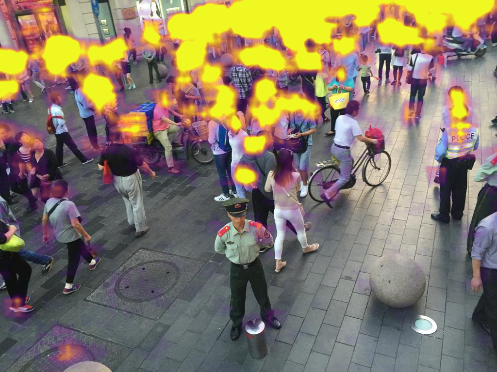
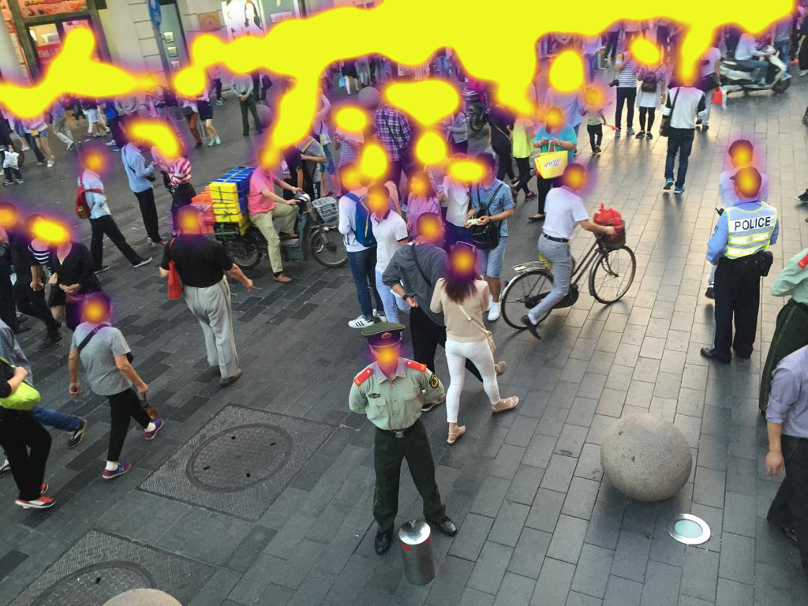

This repository implements a model from [A Real-Time Deep Network for Crowd Counting](https://arxiv.org/abs/2002.06515), and applies it to the ShanghaiTech dataset.

It provides trained weights as well as scripts to train it on an AWS VM.

### Installation

```bash
git clone https://github.com/jplumail/people-counting
pip install -r requirements.txt
```

Download the ShanghaiTech dataset [here](https://www.kaggle.com/tthien/shanghaitech).
Unzip it under the data/ folder.
Launch the `density_gen.py` script to generate the density maps : `python density_gen.py`.

### Train

To train a model on an AWS, type `./start.sh`, it will launch a docker inside the VM. It will launch a Tensorboard opened to the web (you must open the port 6006 in the configuration first). The logs/weights will be saved on AWS S3.

### Test

Run `test.py`. It will create a directory with all of the density maps.

 
*Prediction/groundtruth density maps comparison, summing these yield the counting*